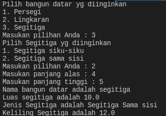

# TUGAS 4 ASISTENSI PBO - Jumat, 11 Oktober 2019

NAMA: MAULIDATUL FUNNA

NRP: 06111840007002

## Deskripsi Tugas


### Implementasikan Flow chart berikut untuk Main Class:


### Dengan ketentuan:


## Contoh:




## Soal

1. Jenis bangun datar adalah persegi dengan sisi 10 cm
2. Jenis bangun datar adalah lingkaran dengan jari 20 cm
3. Jenis bangun datar adalah segitiga siku-siku dengan alas 5 cm dan tinggi 12
4. Jenis bangun datar adalah segitiga sama sisi```*``` dengan alas 4 cm dan tinggi 8

**catatan** \
 ```asumsikan merupakan segitiga sama sisi```
## Screenshot hasil


## Upload
upload seluruh folder project java-nya ke repository ini
